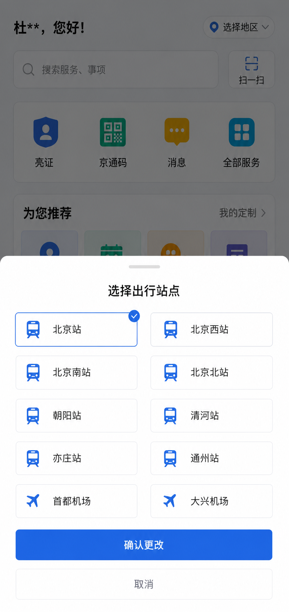
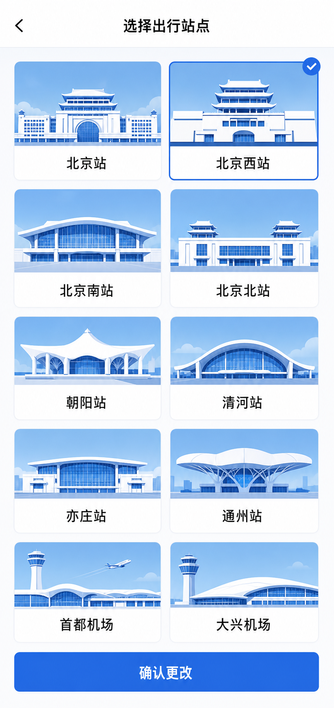
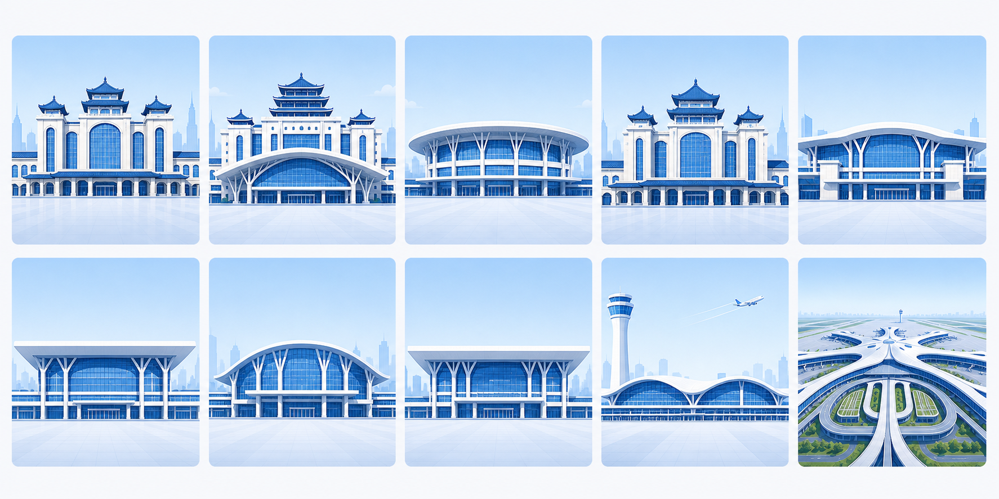
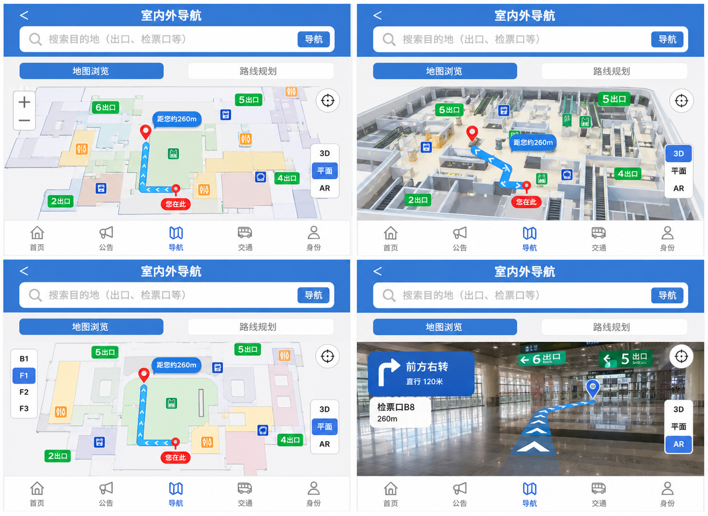
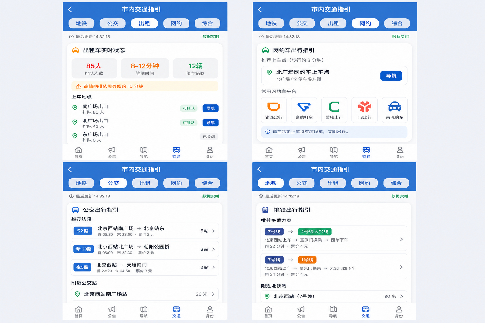
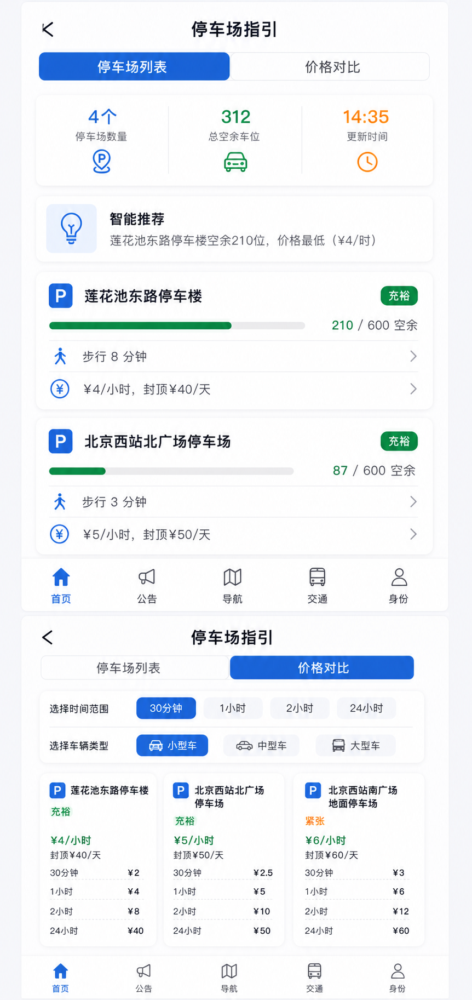
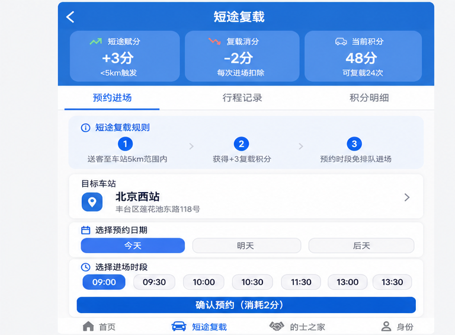

# 当前理解与下一步

我现在把这个项目理解成两层。外层是一个纯 HTML/CSS/JS 的移动端原型，真正负责的是页面结构、点击层级、状态切换和可读性；内层是给这套原型定语气、定边界、定素材的图片锚点。前者解决“能不能点、点了去哪、页面之间怎么串”，后者解决“它应该长什么样、哪些地方必须用图、哪些地方继续用结构化组件”。所以这次不是先追求一张特别像老师原稿的漂亮图，而是先把整个页面骨架、文字、互动关系和图片位置都钉住，再往里填视觉。

你最先看到的那 8 张风格锚点，已经把整个项目的语气收紧了。它们不是最终页面，而是设计语法：白底、浅灰分隔、蓝色主色、克制阴影、偏政务服务工具感的密度。这里面最重要的不是某一个按钮长什么样，而是整套页面在视觉上应该统一到什么程度，不能再回到原稿那种又松又散、像临时拼出来的感觉。这个阶段我已经确认，后面真正做 HTML 时，页面不需要再重新发明一套风格，只要沿着这套语气去铺开就行。

站区切换页我已经单独抽出来了，因为这是一类必须改交互、又必须保留原始信息的页面。现在的版本保留了“选择出行站点”这个入口结构，也保留了站点卡片的选择态和底部确认更改按钮，同时把原稿里底部那一排多余站名胶囊删掉了。这个页面的意义不只是“长得对”，而是它已经能证明我理解了你最在意的那件事：不是把页面画得花，而是把真实使用时该出现的按钮、层级和确认动作放在正确的位置上。

我这次还把 `#/services` 从截图热区页单独拎出来了。它现在不再是一张被点击区域覆盖的图，而是一个真实的左右分栏目录：左边保留老师原稿里的分类层级和当前高亮状态，右边把原图能看到的三组内容拆开，分别是交通出行、机场服务、到站北京畅行服务。旅客端和司机端入口已经直接跳到对应路由，其余服务项先用原型反馈承接，这样做的目的不是把它做成最终视觉，而是先把服务目录的点击树和文字骨架钉牢，后面换图也不会碰坏路由关系。

我现在最需要你帮我检查的，其实是站点建筑这组图。当前运行版按北京站、北京西站、北京南站、北京北站、清河站、朝阳站、丰台站、通州站、首都机场、大兴机场维护十个站点，其中丰台站已改用用户提供照片包里的真实站房照片压缩图。早期生成图更像“风格锚点”而不是“真实建筑照片”，所以会有相似性。换句话说，它们能帮 HTML 原型建立稳定外观，但如果后面要更写实的站房对应关系，需要继续补真实参考或重新单独做每个站。

导航、交通、停车和短途复载这几组页面，我现在把它们看成功能锚点，不是最终视觉稿。导航页已经把平面、3D、AR 的切换关系说明白了，交通页把出租、网约、公交、地铁和综合几种模式都拆开了，停车页把列表和价格对比两种状态都保住了，短途复载页则把预约、行程、积分这三条线理清了。它们现在的价值不是“精修得多漂亮”，而是我已经可以拿它们直接去做真正的 HTML 页面，不用再猜页面结构，也不用再猜哪些 tab 和卡片会被点击。

停车页和司机页是我已经专门校正过断点的两组参考。它们不是简单的四宫格拼图，因为原始页面本身就是上下两屏不同内容，我如果机械对半切，就会把上一屏尾巴带进下一屏，所以我后来按真实内容断点重切了一次。这个动作其实也说明了我现在的理解：这些图不是单纯拿来欣赏的，它们是给后续 HTML 复原用的结构参考，哪一层该断、哪一层该保留，不能凭感觉。空状态和成功状态也已经单独保留下来，后面投诉、预约、提交这类流程页都可以直接复用，不用临时再补。

下一步我不会再把重心放在继续堆图上，而是会把这些已经落下来的锚点真正变成可运行的 HTML 页面。真正要做的是把页面树和交互树完全铺开：先把首页、站点切换、导航、交通、停车、短途复载、投诉建议、个人中心这些页的路由和点击层级定死，再把每个页面的文字、按钮、tab、选中态、加载态接进去，最后再回头审视站点建筑图是不是需要更强的区分度。如果到那一步你还是觉得现在这批站点图太像、太“统一风格”而不够“真实站点”，我会把它们从风格锚点升级成更明确的单站素材，但不会用 HTML 层的修饰去掩盖图片本身的问题。

现在我又往前推进了一层：把原来主要服务锚点页的视觉规则拆成了全局设计系统 token 和组件库。也就是说，`--a-*` 继续负责 18x9 锚点页的像素稳定，`--ds-*` 则开始负责后续所有新页面的统一外观、间距、圆角、阴影、状态色和可点击控件。为了让这层东西真的能用，我还补了一个 `#/design-system` 的开发预览页，里面会直接显示颜色、排版、按钮、徽标、列表、表单和提示横幅，后续新页面接入前先对照这里，不需要再临时拼一套新的风格词汇。

这轮我还补了一层可见状态反馈：站区切换后，首页顶端站名不再死锁在北京西站，默认状态仍沿用原截图，但切到其他站点时会用动态覆盖层显示当前站点。配合这个改动，我用 headless Chrome/CDP 把 47 个页面路由、47 个链接目标和几条关键交互链路都跑过一遍，确认没有死链，也没有把选站、分类、加减数量这些原型动作搞断。

现在我又把更靠近业务骨架的那一层接上了：`station home`、`feedback submit/mine`、`traveler profile`、`driver profile` 已经从旧截图壳切成新的 `ab-*` 页面底座，顶部栏、卡片、选项网格、信息列表、记录卡和底部导航都统一到同一套结构里了。这样做的目的不是替页面定最终长相，而是先把未来重构真正会复用的页面框架稳定下来，后面不管是换视觉稿还是继续加新功能页，都可以直接沿这套底座铺开。

我还顺手把司机站点详情里的场区地图补成了真正可复用的标签组件，`#/driver/station/beijing-map` 现在已经不是一块裸文本区域，而是能承载地图预览、状态提示和两个独立区域入口的二级页面。这个补齐虽然不大，但它说明这套 `ab-*` 底座已经不只会处理“列表 + 卡片”，也能接住后续更多层级的业务页。
