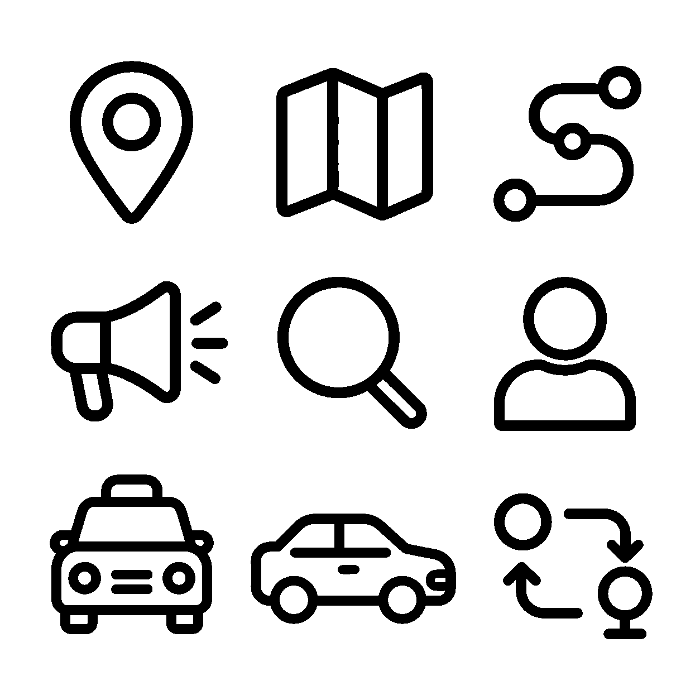
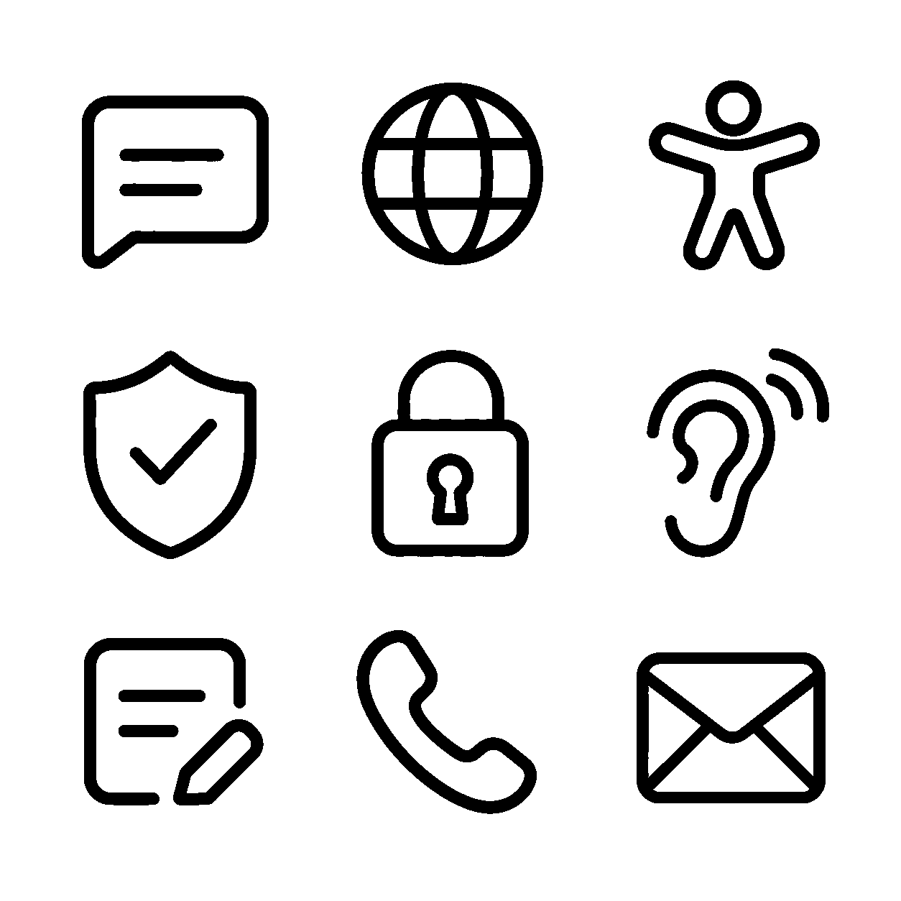
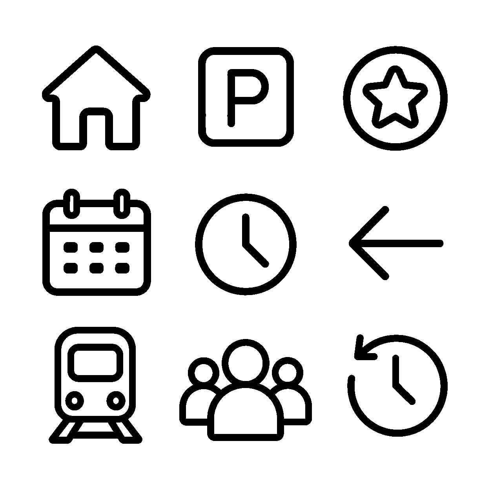
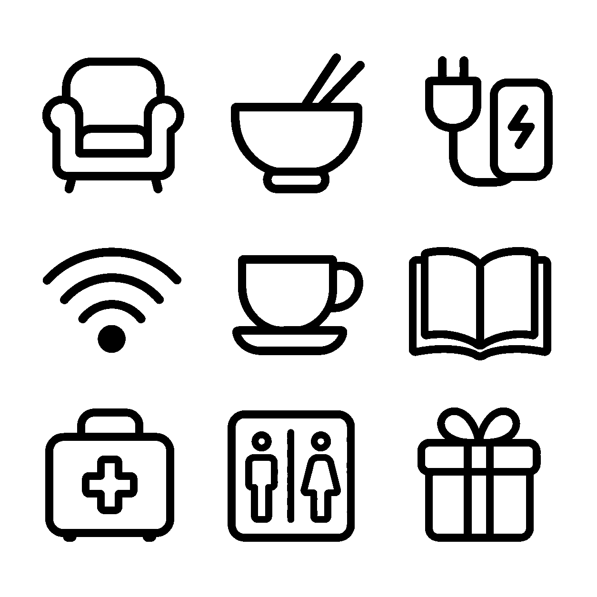
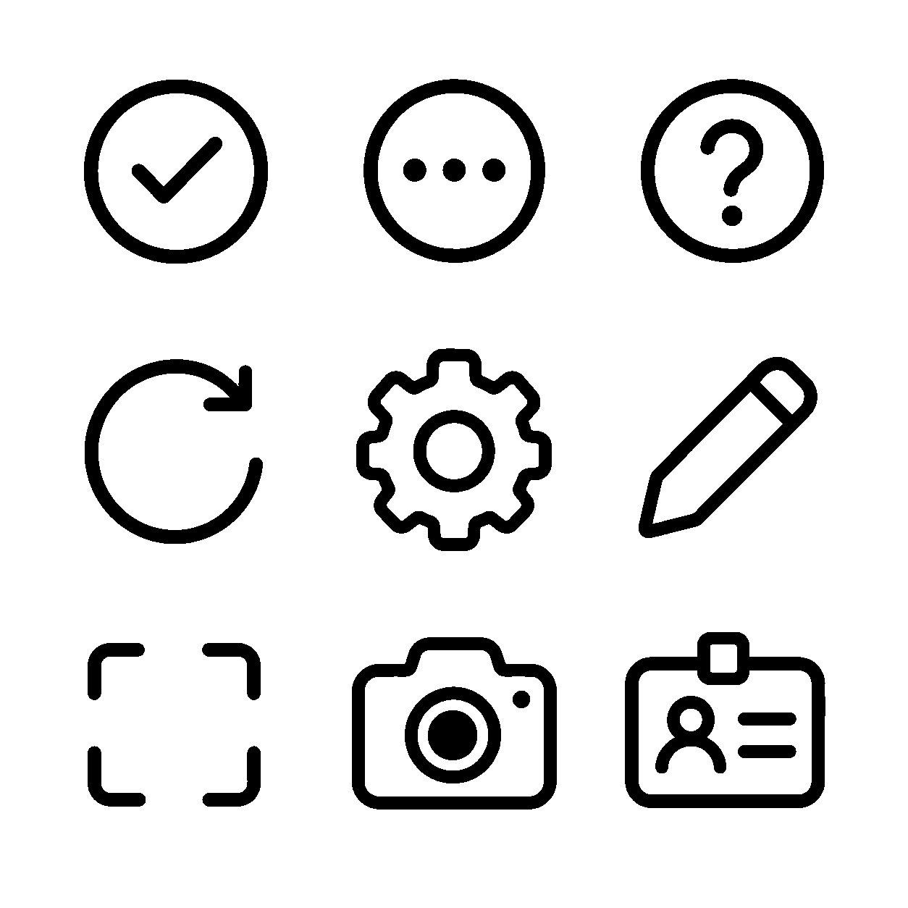
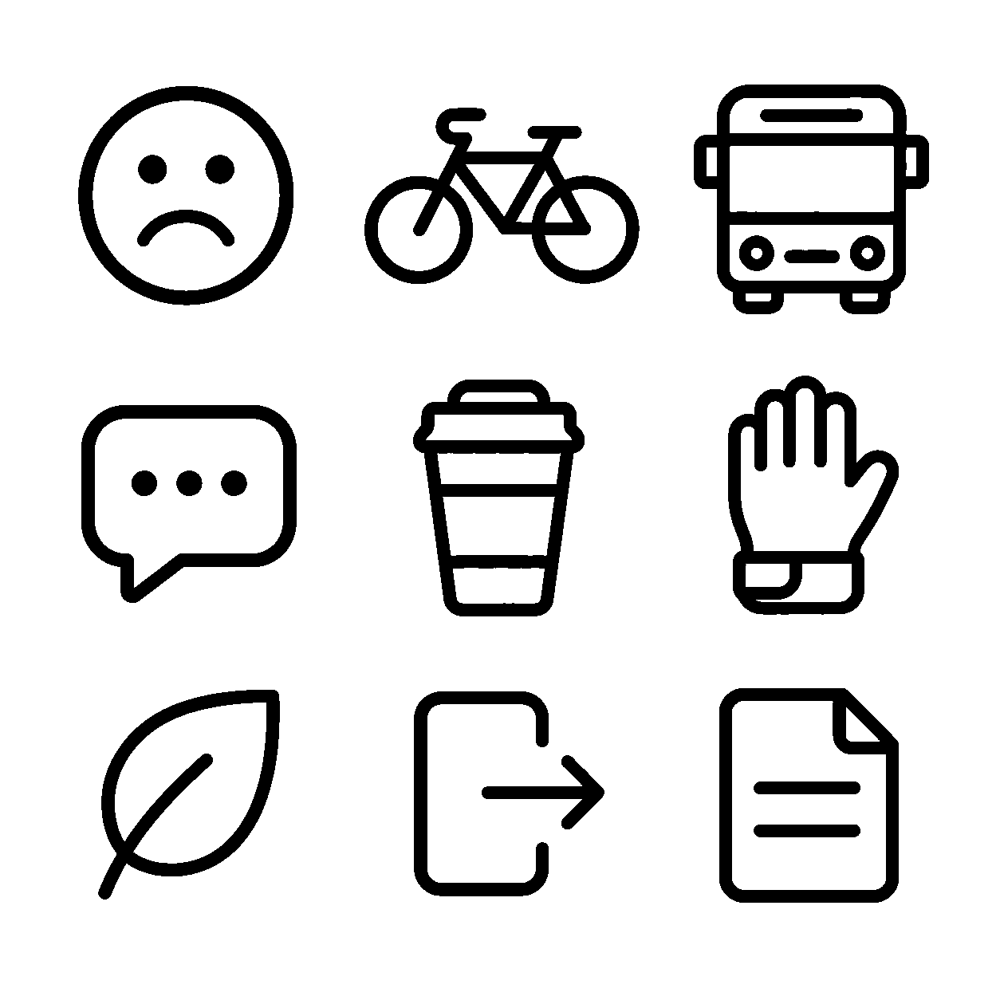
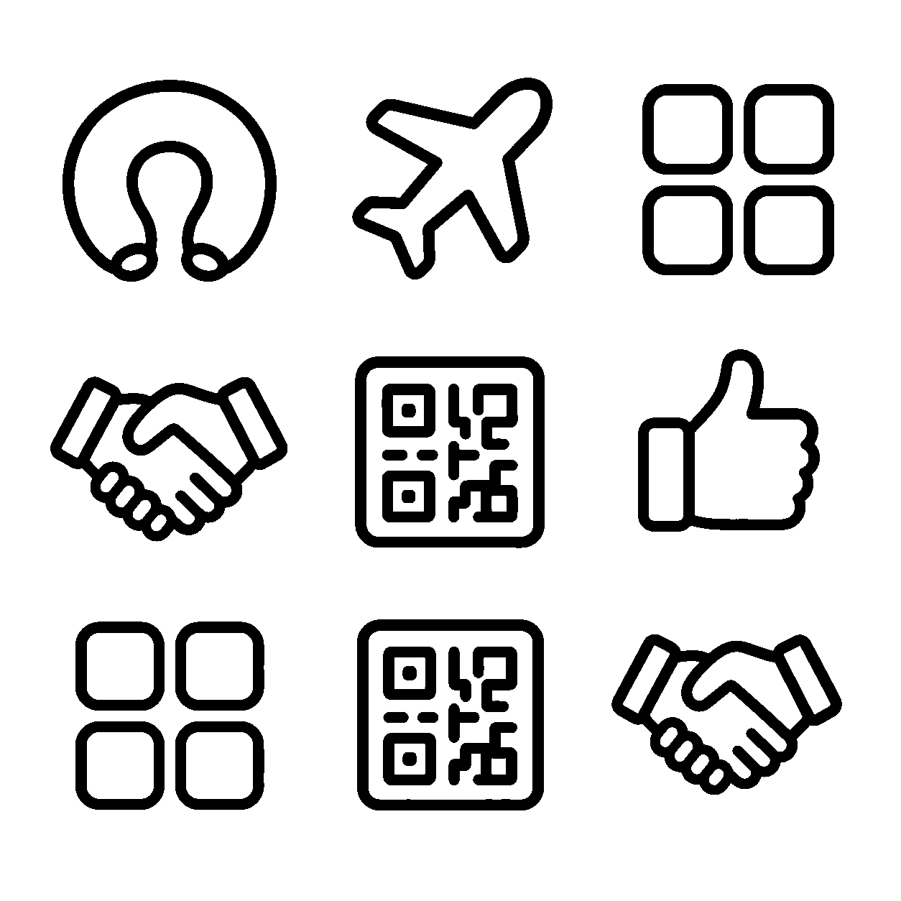
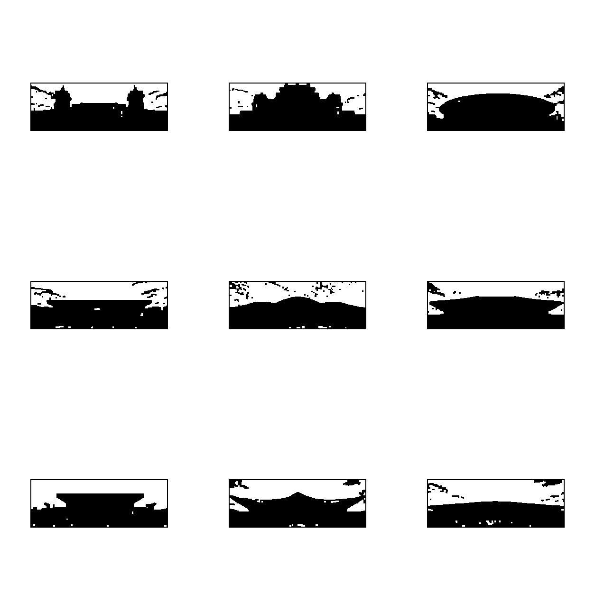
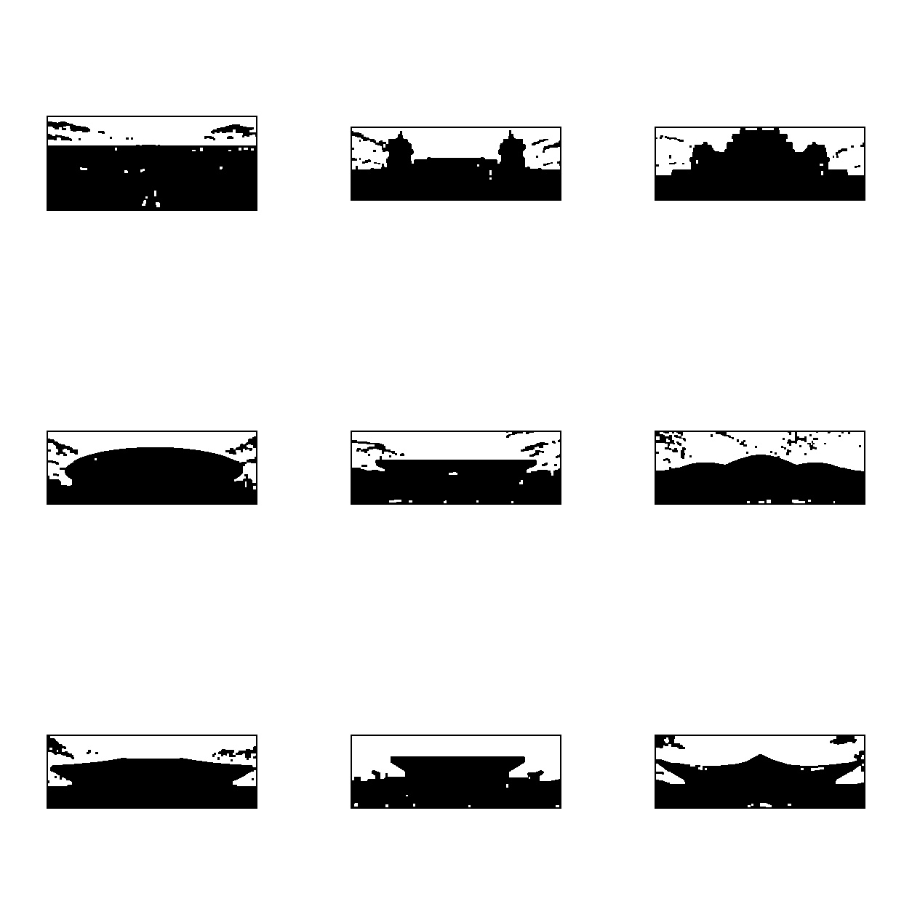

# Icon Calibration Log

本文件记录图标生图、视觉检查、CSV 模拟和像素比对结果。这里只处理图标形状，不处理页面中文文案；页面文字仍遵守“不用 OCR / 不用位图自动识别”的规则。

## 2026-05-27 非站点源图加粗刷新

用户确认以 `board-01` 的 iteration-10 视觉为准后，本轮把非站点图标 `board-01` 到 `board-07` 全部重新写回正式资产。站点图标 `board-08`、`board-09` 不重生。

本轮提示词不依赖对话上下文，核心口径为：

```text
Create a square 3x3 board of simple black outline icons.
The board should feel like a plain icon calibration target:
sparse, geometric, low-detail, and consistent.
Pure black outline glyphs with white interiors.
Rounded caps and joins.
Thick strokes around 26 px on this 1024 px board.
```

提示词技巧：当模型被某个词带向复杂图形时，优先“不提及”触发复杂联想的词，让它回到 plain/sparse/geometric 的基础图标语言；只有确实需要的语义才写入图标清单。

本轮选择结果：

| 批次 | 处理结果 |
| --- | --- |
| `board-01-high-frequency` | 采用 iteration-10；喇叭简化，transfer 回到 05 方向 |
| `board-02-settings-feedback` | 重生 message/globe/accessibility/shield/lock/ear/feedback/phone/mail |
| `board-03-service-utility` | 重生 home/parking/points/calendar/clock/back/train/people/history；返回箭头保持单线 |
| `board-04-taxi-house` | 重生 lounge/dining/charger/wifi/tea/book/medical/restroom/gift |
| `board-05-interface-controls` | 重生 check/more/question/refresh/settings/edit/scan/camera/id |
| `board-06-mobility-feedback` | 重生 angry/bike/bus/chat/cup/glove/leaf/logout/paper；退出图标保持单线右箭头 |
| `board-07-remaining-utility` | 重生 pillow/plane/grid/handshake/qr/thumb/grid/qr/handshake |

七批均重新执行：

```bash
python3 scripts/icon_sheet_tools.py extract ...
python3 scripts/icon_svg_replica.py ...
```

结果均为：

```json
{
  "pass": true,
  "maxDiffRatio": 0.0
}
```

`renderIcon()` 已移除运行时同色描边加粗，页面只使用源 target 复刻出的 `currentColor` SVG mask。

## Board 01 - 高频服务图标



### 覆盖图标

第一批覆盖首页、底栏、设置页和交通页里最常出现的 9 个语义：

1. `pin` 定位
2. `map` 导航地图
3. `route` 市内交通路线
4. `megaphone` 站区公告
5. `search` 搜索
6. `user` 身份/个人中心
7. `taxi` 出租/短途复载
8. `car` 网约车/小汽车
9. `transfer` 场站接驳

### 生成与修复

- 旧版问题：线条偏细，第二、第三批曾短暂使用旧 SVG target，和第一批生图 target 的气质不一致。
- 本轮重新提示：图标板使用自包含的 plain icon calibration target 口径，强调 sparse、geometric、low-detail、1024px 图板约 26px 粗线、纯白背景、无文字、无阴影。
- 后期修复：保留加粗生图的语义和构图，把背景统一成纯白，把图标线条阈值化成纯黑，得到最终校准板。

### 文件

- 原始生图：`assets/icons/calibration/board-01-high-frequency/generated-raw.png`
- 清理后校准板：`assets/icons/calibration/board-01-high-frequency/board-clean.png`
- CSV 与切片结果：`assets/icons/calibration/board-01-high-frequency/csv-check/`
- 比对报告：`assets/icons/calibration/board-01-high-frequency/csv-check/manifest.json`
- 单图放大与 SVG mask 复刻：`assets/icons/calibration/board-01-high-frequency/single-svg-replica/`

### 像素检查

使用命令：

```bash
python3 scripts/icon_sheet_tools.py extract \
  --input assets/icons/calibration/board-01-high-frequency/board-clean.png \
  --out assets/icons/calibration/board-01-high-frequency/csv-check \
  --names pin,map,route,megaphone,search,user,taxi,car,transfer
```

结果：

```json
{
  "pass": true,
  "maxDiffRatio": 0.0
}
```

这里的 `0.0` 表示 CSV alpha 模拟图与清理后的目标图完全一致，满足 `diffRatio <= 5%` 的门槛。

### 单图拆分与页面图标复刻

之前的 CSV 检查只能证明“切出的目标图”和“CSV 模拟图”一致，不能证明页面里正在用的 SVG 也贴近目标。按新的检查口径，已经把 3x3 图标板拆成 9 张独立目标图，并为每张图生成 3 倍放大图，便于看清轮廓：

- 单图目标：`assets/icons/calibration/board-01-high-frequency/single-svg-replica/targets/`
- 3 倍放大：`assets/icons/calibration/board-01-high-frequency/single-svg-replica/enlarged-3x/`
- SVG mask：`assets/icons/calibration/board-01-high-frequency/single-svg-replica/svg/`
- 页面加载脚本：`assets/icons/calibration/board-01-high-frequency/single-svg-replica/icon-replicas-board-01.js`
- 新比对报告：`assets/icons/calibration/board-01-high-frequency/single-svg-replica/manifest.json`

使用命令：

```bash
python3 scripts/icon_svg_replica.py \
  --input assets/icons/calibration/board-01-high-frequency/board-clean.png \
  --out assets/icons/calibration/board-01-high-frequency/single-svg-replica \
  --names pin,map,route,megaphone,search,user,taxi,car,transfer
```

结果：

```json
{
  "pass": true,
  "maxDiffRatio": 0.0
}
```

页面里的第一批 9 个高频图标现在优先使用这份单图复刻结果。复刻用完整 cell 做像素 diff，同时把每个图标真实黑色线条的 `inkBBox` 裁出来，加 6% padding 后写成页面显示用 viewBox。这个 viewBox 不再强行做成统一方形，而是让浏览器把裁出的图标矩形居中放进方形 icon 盒子里，避免九宫格白边导致图标过小。

### 进入组件库的结论

当前 `ICON_LIBRARY` 已经包含这 9 个语义，并且页面引用已经改为这些语义名。运行时渲染顺序为：第一批单图复刻 `ICON_REPLICA_LIBRARY` 优先，其次回落到手写 `ICON_LIBRARY`。后续不再让页面临时手写图标；如果某个页面需要新语义，先更新 `ICON_LIBRARY`、`docs/ui/icon-inventory.json`，并按需要生成新的单图复刻批次。

### 当前可见页面

这批图标已经应用到真实页面和设计系统预览页。最集中查看的位置是：

- `http://127.0.0.1:4174/#/design-system`：新增“图标系统 / 第一批校准”区块，一次能看到 9 个图标。
- `http://127.0.0.1:4174/#/station/home`：首页首屏能看到 `pin`、`megaphone`、`search`、`map`、`route`、`transfer`、`user`、`taxi`、`car`，是当前最完整的业务页验证入口。

按图标拆开看：

| 图标 | 主要可见页面 |
| --- | --- |
| `pin` | `#/station/home`、`#/traffic/taxi`、`#/driver/short-haul/booking`、`#/driver/taxi-house/info`、`#/style-anchor/03-detail`、`#/style-anchor/05-completion` |
| `map` | `#/station/home`、`#/nav/map`、`#/traffic/mixed`、`#/design-system` |
| `route` | `#/station/home`、旅客端底栏的“交通”入口、`#/profile`、`#/design-system` |
| `megaphone` | `#/station/home`、旅客端底栏的“公告”入口、`#/announcements`、`#/design-system` |
| `search` | `#/station/home`、`#/driver/queue`、`#/design-system`、`#/style-anchor/02-list` |
| `user` | `#/station/home`、`#/profile`、`#/driver/profile`、`#/driver/station/beijing`、`#/design-system` |
| `taxi` | `#/station/home`、`#/traffic/taxi`、`#/driver/short-haul/booking`、司机端底栏“短途复载”入口 |
| `car` | `#/station/home`、`#/traffic/ride`、`#/traffic/mixed`、`#/style-anchor/03-detail` |
| `transfer` | `#/station/home` 的“场站接驳”入口、`#/design-system` |

## Board 02 - 设置反馈图标



### 覆盖图标

第二批覆盖个人中心、反馈页、联系信息和安全设置里反复出现的 9 个语义：

1. `message` 消息
2. `globe` 语言
3. `accessibility` 无障碍
4. `shield` 账号安全
5. `lock` 隐私
6. `ear` 辅助
7. `feedback` 反馈
8. `phone` 电话
9. `mail` 邮箱

### 生成与修复

这批已废弃旧 SVG target，改为和第一批同一口径的加粗生图 target。提示词明确要求粗一档的黑色 monoline、统一光学大小、纯白背景、无文字、无阴影。生图后仍只作为校准目标，最终页面资产继续由 `currentColor` SVG mask 承载。

### 文件

- 原始生图：`assets/icons/calibration/board-02-settings-feedback/generated-raw.png`
- 清理后校准板：`assets/icons/calibration/board-02-settings-feedback/board-clean.png`
- CSV 与切片结果：`assets/icons/calibration/board-02-settings-feedback/csv-check/`
- 单图放大与 SVG mask 复刻：`assets/icons/calibration/board-02-settings-feedback/single-svg-replica/`
- 页面加载脚本：`assets/icons/calibration/board-02-settings-feedback/single-svg-replica/icon-replicas-board-02.js`

### 像素检查

CSV 模拟检查：

```json
{
  "pass": true,
  "maxDiffRatio": 0.0
}
```

单图 SVG mask 复刻检查：

```json
{
  "pass": true,
  "maxDiffRatio": 0.0,
  "cropPaddingRatio": 0.06
}
```

第二批已经进入 `#/design-system` 的“图标系统 / 设置反馈”区块。业务页里主要能在 `#/profile`、`#/profile-more`、`#/feedback/submit`、`#/feedback/mine`、`#/driver/profile` 看到。

## Board 03 - 服务工具图标



### 覆盖图标

第三批覆盖底栏、停车、积分、预约、站点和历史记录中更常用的 9 个工具语义：

1. `home` 首页
2. `parking` 停车
3. `points` 积分
4. `calendar` 日期
5. `clock` 时间
6. `back` 返回
7. `train` 车站
8. `people` 人群
9. `history` 历史

### 生成与修复

这批也已废弃旧 SVG target，改为和第一、第二批同一口径的加粗生图 target。提示词把首页、停车、积分、日历、时间、返回、车站、人群、历史全部约束为同一套粗线 monoline 交通服务图标。复刻脚本按每个图标的真实黑色线条计算 `inkBBox`，再加 6% padding 写入 display viewBox，解决九宫格大白边导致小尺寸图标显小的问题。

### 文件

- 原始生图：`assets/icons/calibration/board-03-service-utility/generated-raw.png`
- 清理后校准板：`assets/icons/calibration/board-03-service-utility/board-clean.png`
- CSV 与切片结果：`assets/icons/calibration/board-03-service-utility/csv-check/`
- 单图放大与 SVG mask 复刻：`assets/icons/calibration/board-03-service-utility/single-svg-replica/`
- 页面加载脚本：`assets/icons/calibration/board-03-service-utility/single-svg-replica/icon-replicas-board-03.js`

### 像素检查

CSV 模拟检查：

```json
{
  "pass": true,
  "maxDiffRatio": 0.0
}
```

单图 SVG mask 复刻检查：

```json
{
  "pass": true,
  "maxDiffRatio": 0.0,
  "cropPaddingRatio": 0.06
}
```

第三批已经进入 `#/design-system` 的“图标系统 / 服务工具”区块。业务页里主要能在 `#/station/home`、`#/parking/list`、`#/parking/price`、`#/driver/short-haul/booking`、`#/driver/short-haul/history`、`#/driver/short-haul/points`、`#/driver/queue`、`#/driver/profile` 看到。

## Board 04 - 的士之家服务图标



### 覆盖图标

第四批专门补齐的士之家页面和司机端底栏中视觉不协调的服务设施语义：

1. `lounge` 休息/的士之家
2. `dining` 餐饮
3. `charger` 充电桩
4. `wifi` 免费 WIFI
5. `tea` 茶水供应
6. `book` 阅读角
7. `medical` 医疗急救箱
8. `restroom` 洗手间
9. `gift` 积分兑换

### 生成与修复

这批先用生图模型生成 3x3 target，再用 `scripts/icon_clean_board.py` 清成纯黑白校准板，随后走 CSV 切片和单图 SVG mask 复刻。重点修复了原来“的士之家”底栏复用 `handshake`、基本信息第一行复用定位图标导致语义不准的问题；现在底栏、基本信息首行和服务按钮都使用同一批复刻图标。

### 文件

- 原始生图：`assets/icons/calibration/board-04-taxi-house/generated-raw.png`
- 清理后校准板：`assets/icons/calibration/board-04-taxi-house/board-clean.png`
- CSV 与切片结果：`assets/icons/calibration/board-04-taxi-house/csv-check/`
- 单图放大与 SVG mask 复刻：`assets/icons/calibration/board-04-taxi-house/single-svg-replica/`
- 页面加载脚本：`assets/icons/calibration/board-04-taxi-house/single-svg-replica/icon-replicas-board-04.js`
- 清理脚本：`scripts/icon_clean_board.py`

### 像素检查

CSV 模拟检查：

```json
{
  "pass": true,
  "maxDiffRatio": 0.0
}
```

单图 SVG mask 复刻检查：

```json
{
  "pass": true,
  "maxDiffRatio": 0.0,
  "cropPaddingRatio": 0.06
}
```

第四批已经进入 `#/design-system` 的“图标系统 / 的士之家”区块。业务页里主要能在 `#/driver/taxi-house/info`、`#/driver/taxi-house/meal`、`#/driver/taxi-house/redeem` 和司机端底栏看到。

## Board 05 - 控件补齐图标



### 覆盖图标

第五批补齐界面里最容易被忽略的控制语义：

1. `check` 确认
2. `more` 更多
3. `question` 问号
4. `refresh` 刷新
5. `settings` 设置
6. `edit` 编辑
7. `scan` 扫码
8. `camera` 相机
9. `id` 证件

### 生成与修复

这批同样走了生图 raw target、`scripts/icon_clean_board.py` 清理、CSV 切片和单图 SVG mask 复刻的合规链路，最终把控件图标统一到同一套粗一档 monoline 视觉。

### 结果

CSV 模拟与单图 SVG mask 复刻均通过，`maxDiffRatio <= 5%`。
重新跑完后，CSV 与 SVG mask 的 `maxDiffRatio` 都是 `0.0`。

## Board 06 - 出行反馈图标



### 覆盖图标

第六批补齐出行、情绪和信息反馈语义：

1. `angry` 情绪
2. `bike` 骑行
3. `bus` 公交
4. `chat` 沟通
5. `cup` 杯子
6. `glove` 手套
7. `leaf` 绿色
8. `logout` 退出
9. `paper` 文档

### 生成与修复

这批同样走了生图 raw target、`scripts/icon_clean_board.py` 清理、CSV 切片和单图 SVG mask 复刻的合规链路，最终把出行反馈图标统一到同一套粗一档 monoline 视觉。

### 结果

CSV 模拟与单图 SVG mask 复刻均通过，`maxDiffRatio <= 5%`。
重新跑完后，CSV 与 SVG mask 的 `maxDiffRatio` 都是 `0.0`。

## Board 07 - 剩余杂项图标



### 覆盖图标

第七批补齐剩余库项：

1. `pillow` 枕头
2. `plane` 飞机
3. `grid` 九宫格
4. `handshake` 握手
5. `qr` 二维码
6. `thumb` 点赞
7. `grid` 九宫格（复用占位）
8. `qr` 二维码（复用占位）
9. `handshake` 握手（复用占位）

### 生成与修复

这批同样走了生图 raw target、`scripts/icon_clean_board.py` 清理、CSV 切片和单图 SVG mask 复刻的合规链路，最终把剩余杂项图标统一到同一套粗一档 monoline 视觉。

### 结果

CSV 模拟与单图 SVG mask 复刻均通过，`maxDiffRatio <= 5%`。
重新跑完后，CSV 与 SVG mask 的 `maxDiffRatio` 都是 `0.0`。

## Board 08 - 站点轮廓图标 A



### 覆盖图标

第八批把站点选择卡片左下角从旧 PNG 小图标切到统一 `currentColor` SVG mask。第一组覆盖：

1. `station_beijing` 北京站
2. `station_west` 北京西站
3. `station_south` 北京南站
4. `station_north` 北京北站
5. `station_chaoyang` 朝阳站
6. `station_qinghe` 清河站
7. `station_yizhuang` 亦庄站
8. `station_tongzhou` 通州站
9. `station_capital` 首都机场

### 生成与修复

这批不再复用 `extracted_page04_station_icons/` 的旧 PNG，也不再从站点图片直接算法提取轮廓。正确流程是：先人工视觉查看 10 张站点建筑图，把建筑特征写进提示词，让生图模型重绘成 3x3 黑白 icon target；随后用 `scripts/icon_clean_board.py` 清成纯黑白校准板，再进入 CSV alpha 模拟、单图拆分、3 倍放大和 SVG mask 复刻。这个过程不读取图片中的文字，也不使用 OCR。

### 文件

- 原始轮廓板：`assets/icons/calibration/board-08-station-icons-a/generated-raw.png`
- 清理后校准板：`assets/icons/calibration/board-08-station-icons-a/board-clean.png`
- CSV 与切片结果：`assets/icons/calibration/board-08-station-icons-a/csv-check/`
- 单图放大与 SVG mask 复刻：`assets/icons/calibration/board-08-station-icons-a/single-svg-replica/`
- 页面加载脚本：`assets/icons/calibration/board-08-station-icons-a/single-svg-replica/icon-replicas-board-08.js`

### 结果

CSV 模拟与单图 SVG mask 复刻均通过，`maxDiffRatio = 0.0`。这批图标已经进入 `#/design-system` 的“图标系统 / 站点轮廓 A”区块，并用于 `#/station/select`、`#/station/switch` 站点卡片左下角。

## Board 09 - 站点轮廓图标 B



### 覆盖图标

第九批补齐第十个站点，并复用一部分站点轮廓保持 3x3 板完整：

1. `station_daxing` 大兴机场
2. `station_beijing` 北京站
3. `station_west` 北京西站
4. `station_south` 北京南站
5. `station_north` 北京北站
6. `station_chaoyang` 朝阳站
7. `station_qinghe` 清河站
8. `station_yizhuang` 亦庄站
9. `station_tongzhou` 通州站

### 生成与修复

大兴机场单独进入第二组；其余重复站点用于保持九宫格构图一致。第二组同样由生图模型根据站点建筑图视觉特征重绘为 icon target，而不是直接从原图扣轮廓。页面加载顺序为 board-08 后接 board-09，重复语义形状一致，不影响最终显示；`station_capital` 来自 board-08，`station_daxing` 来自 board-09。

### 文件

- 原始轮廓板：`assets/icons/calibration/board-09-station-icons-b/generated-raw.png`
- 清理后校准板：`assets/icons/calibration/board-09-station-icons-b/board-clean.png`
- CSV 与切片结果：`assets/icons/calibration/board-09-station-icons-b/csv-check/`
- 单图放大与 SVG mask 复刻：`assets/icons/calibration/board-09-station-icons-b/single-svg-replica/`
- 页面加载脚本：`assets/icons/calibration/board-09-station-icons-b/single-svg-replica/icon-replicas-board-09.js`

### 结果

CSV 模拟与单图 SVG mask 复刻均通过，`maxDiffRatio = 0.0`。`node scripts/icon_inventory.mjs` 已能把 replica-only 的 `station_*` 语义计入清单，当前没有缺失图标。

## 当前组件库结论

九批合计 70 个唯一复刻图标已经进入统一复刻库，其中 60 个为基础业务图标，10 个为站点轮廓图标。运行 `node scripts/icon_inventory.mjs` 后，当前状态为：60 个基础 SVG、70 个复刻 SVG mask、所有已用语义均已覆盖、0 个缺失、0 个未覆盖库项。后续新增图标必须继续先进入图标清单，再按 3x3 组补充校准，不允许页面局部临时画图标或回退到旧 PNG。
